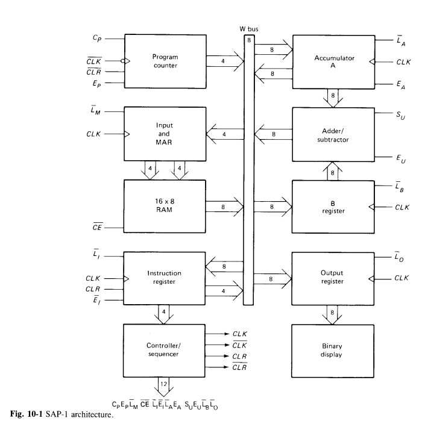
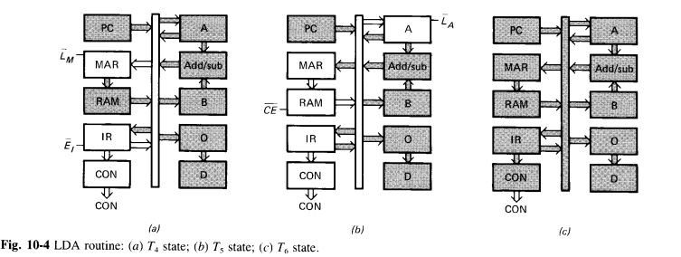
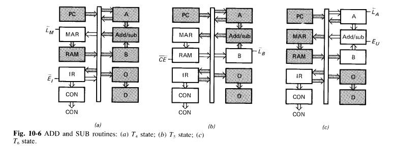
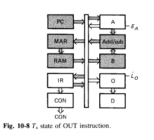
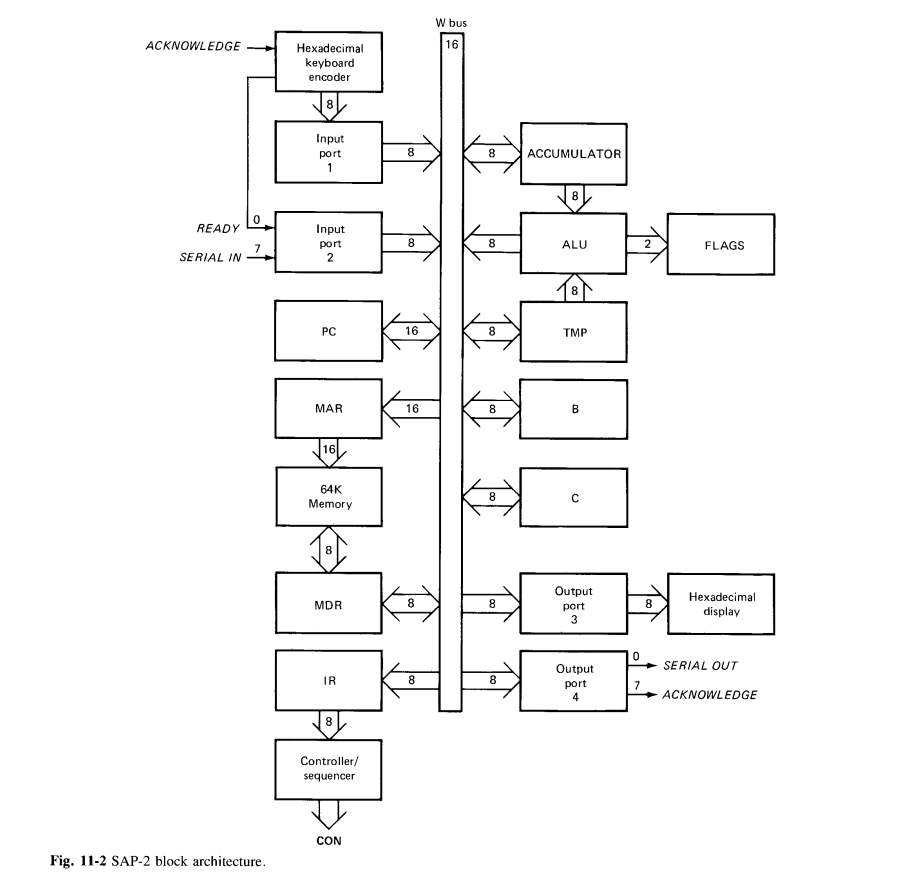
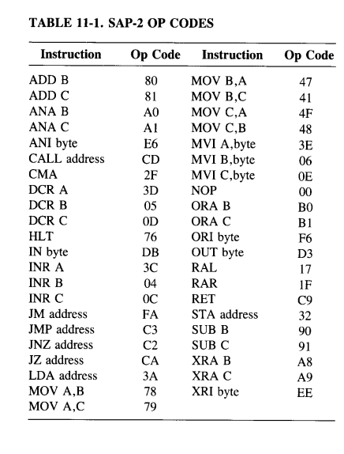

# SAPx_verilog

Verilog files for SAP-1, SAP-2, and SAP-3 architectures. Nothing fancy, just an exercise.

# SAP-1

Deported all the ENABLE signals to the bus controller (tri state being impossible for internal signals). The LOAD / LATCH signals are on each components.

A, B, instr and ouput regs are done with same component.

## Controller

# SAP-2

